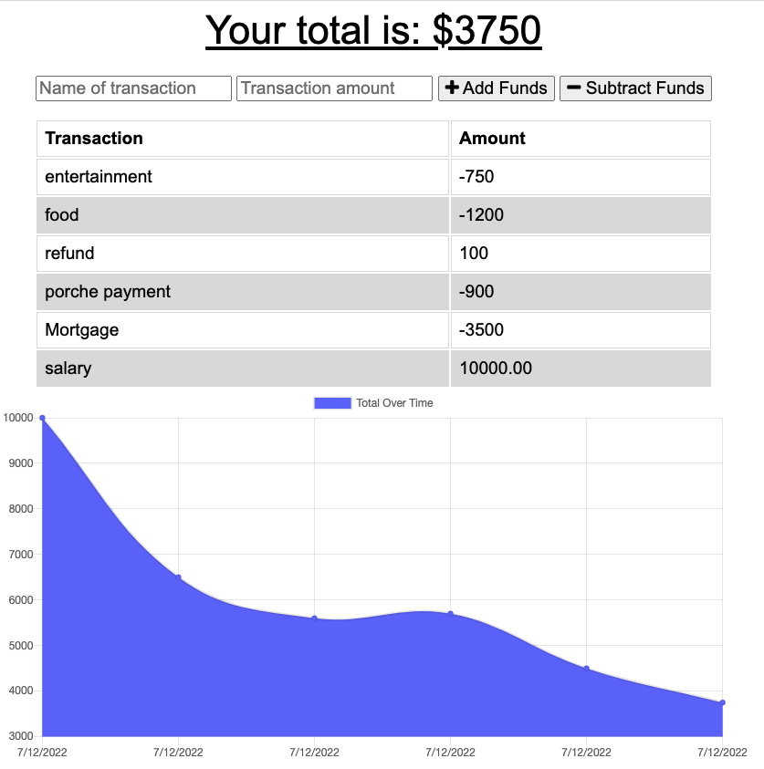
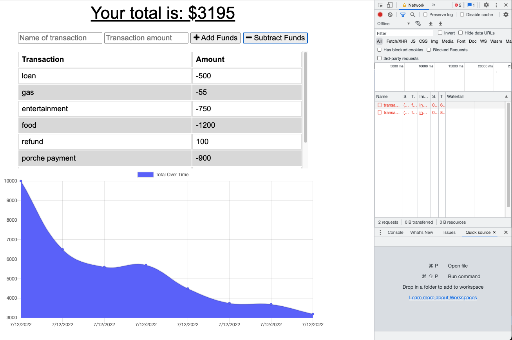
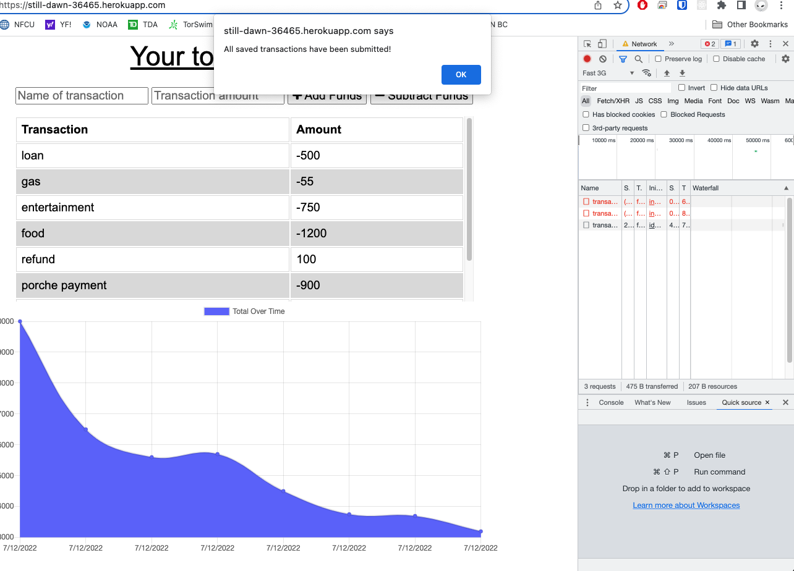

# Budget Tracker

Budget Tracker is an application to allow for offline access and functionality. User can add expenses and deposits to their budget with or without a connection. If the user enters transactions offline, the total will be updated when they're brought back online.

# Table of Contents

- [Installation](#installation)
- [Usage](#usage)
- [License](#license)
- [Contribute](#contribute)
- [Questions](#questions)
- [Github Profile](#github)
- [Deployed App](#deployed-app-on-heroku)

## Installation

The app is deployed on Heroku but you can also install it locally following these steps:

- Install node.js
- download the repo: https://github.com/bagl0025/budget-tracker.git
- The dependencies can be installed by running `npm install`

- Run the application using `npm start` or `node server`

## Usage

Enter a transaction name and amout and click add or substract funds.

## Budget Tracker screenshots

### Normal usage (online)

### Offline usage

### Returning to online

## License

This software is under the [MIT](./LICENSE) license.

## Contribute

Refer to [Contributor Covenant](https://www.contributor-covenant.org/) for contribution guidelines.

## Questions

Contact author at bagley@umn.edu for questions or to report issues.

## GitHub

https://github.com/bagl0025/budget-tracker.git

## Deployed app on Heroku

https://still-dawn-36465.herokuapp.com/
